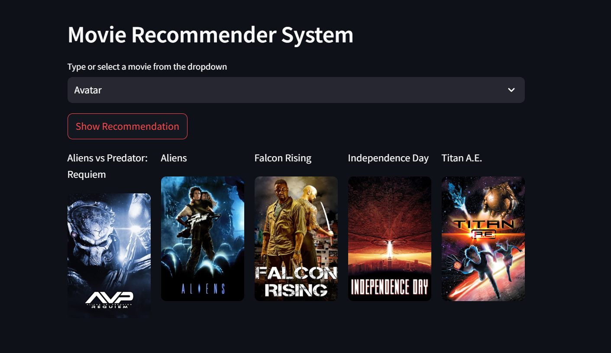

# 🎬 Movie Recommender System

An intelligent **Movie Recommendation Web App** built using **content-based filtering** on the **TMDB 5000 Movie Dataset**. It analyzes movie metadata (genres, keywords, cast, crew, overview) and recommends **the 5 most similar movies** to the one selected by the user. Deployed live on Heroku 👉 [**Try it here**](https://movrs-vkc-8d37e01f4f9a.herokuapp.com/)

---

## 🌟 Features

* 🎥 **Content-Based Recommendations** using:

  * **TF-IDF / Count Vectorization** of combined movie metadata
  * **Cosine Similarity** for similarity measurement
* 🧠 **Smart Tag Generation** combining key features:

  * Genres, keywords, overview, cast, and crew
* 🖼️ **Dynamic Posters** fetched via **TMDB API**
* ☁️ **Deployed on Heroku** for easy access anywhere
* 🧩 **Interactive Web Interface** — simple, clean, and fast

---

## 🧰 Tech Stack

| Component      | Technology                                                         |
| -------------- | ------------------------------------------------------------------ |
| **Language**   | Python                                                             |
| **Libraries**  | pandas, numpy, scikit-learn, requests, flask / streamlit, gunicorn |
| **Dataset**    | TMDB 5000 Movie Dataset (movies + credits)                         |
| **API**        | The Movie Database (TMDB) API                                      |
| **Deployment** | Heroku                                                             |

---

## ⚙️ How It Works

1. **Data Preparation**

   * Combine `movies.csv` and `credits.csv` from the TMDB dataset.
   * Extract and preprocess features: genres, keywords, cast, crew, and overview.

2. **Feature Engineering**

   * Create a unified text field called **`tags`** for each movie.
   * Vectorize the tags using **TF-IDF** or **CountVectorizer** to obtain numeric vectors.

3. **Similarity Computation**

   * Compute **cosine similarity** between movie vectors.
   * For a selected movie, fetch the top 5 most similar movies.

4. **Poster Retrieval**

   * Use TMDB API to fetch poster image URLs for each recommended movie.

5. **Frontend Integration**

   * Simple UI to select a movie and display recommendations with posters and titles.

---

## 🚀 Live Demo

Deployed on Heroku: **[https://movrs-vkc-8d37e01f4f9a.herokuapp.com/](https://movrs-vkc-8d37e01f4f9a.herokuapp.com/)**

---

## 📦 Run Locally

### Prerequisites

* Python 3.8+
* `pip` and virtual environment (recommended)
* (If using LFS) Git LFS for large files

### Install

```bash
git clone https://github.com/VishnuKC26/movie-recommender-system.git
cd movie-recommender-system
python -m venv venv
# Windows
venv\Scripts\activate
# macOS / Linux
# source venv/bin/activate
pip install -r requirements.txt
```

### Run (Flask)

```bash
# if app.py is a Flask app
export FLASK_APP=app.py      # macOS / Linux
set FLASK_APP=app.py         # Windows (cmd)
flask run
# or
python app.py                # if it runs directly
```

### Run (Streamlit)

```bash
streamlit run app.py
```

Open `http://localhost:5000` (Flask) or the Streamlit URL shown in the terminal.

---

## 📂 Project Structure

```
movie-recommender-system/
│
├── app.py                # Main web application (Flask or Streamlit)
├── similarity.pkl        # Precomputed similarity matrix (large — use LFS or ignore)
├── tmdb_5000_movies.csv  # Dataset file
├── tmdb_5000_credits.csv # Dataset file
├── requirements.txt      # Python dependencies
├── Procfile              # For Heroku deployment (if applicable)
├── runtime.txt           # Python runtime for Heroku (optional)
├── static/ or images/    # Optional static assets
└── README.md             # Project documentation
```

---

## 🧪 Example Recommendation

If you select **"The Dark Knight"**, the app might suggest: *Inception, Batman Begins, The Dark Knight Rises, Man of Steel,* and *Iron Man*. Each recommendation includes a poster fetched from TMDB.




## 🧾 License

This project is released under the **MIT License**.

---

## 🧑‍🎓 Author

**Vishnu Kant** — GitHub: [@VishnuKC26](https://github.com/VishnuKC26)

---

## 🔗 Acknowledgements

* TMDB 5000 Movie Dataset (Kaggle)
* The Movie Database (TMDB) API
* Heroku
